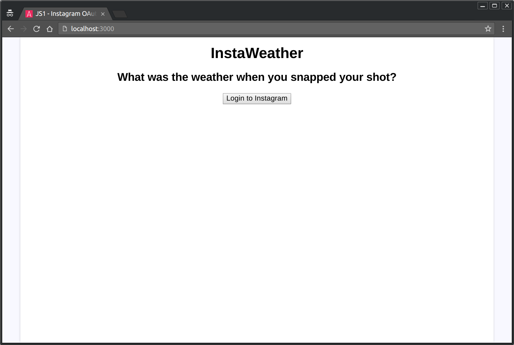
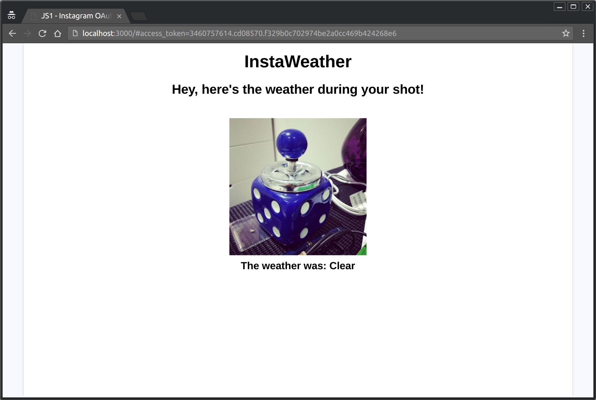

# Instagram OAuth Exercise

Let's create an app that shows the weather at the same locatiton _and time_ as
a photo taken on Instagram!

We'll use OAuth to get the user's Authorization to access their photos on
Instagram, then retrieve the photos directly from Instagram's API.

Our final app will look something like:



_Before Authorizing access to Instagram_



_After Authorization has been granted and our app has retrieved photos_

## Resources

- [Instagram's API](https://www.instagram.com/developer)
- [Forecast.io's API](https://developer.forecast.io/docs/v2)

## Getting Started

Before we get coding, we need to set up our environment.

When we setup our Instagram account, we added the following info:

- **Valid redirect URIs**: `http://localhost:3000`

This is the URL Instagram will send the User to once they've authorized our
application. But what _is_ this URL?

### `localhost`

`http://localhost` is a URL that is only available on your computer. MDN has
this to say:

> Understanding localhost
> 
> In the world of DNS, there is one special address that every machine knows:
> localhost. This is a reference to your own server, located on your personal
> machine. You can hit localhost with your browser without even being connected
> to the Internet.
> 
> Note: localhost actually points to a reserved IP address that loops back to
> your own machine: 127.0.0.1 (IPv4) or ::1 (IPv6).  Try accessing your
> localhost: http://localhost. If you see something similar to "It works!", then
> Congratulations! You already have a web server installed on your machine.
> (Mac OS X, for example, comes with Apache preloaded.)

- https://developer.mozilla.org/en-US/Learn/Common_questions/Set_up_a_basic_working_environment#Understanding_localhost

### `:3000`

Ok, so what's the `:3000` part at the end? It's a particlar program that's
available via `localhost`. The number 3000 is arbitrary (as long as it's 1024 or
higher), but a common one to use for applications we're building.


### Running our application on `http://localhost:3000`

To get our application up and running, we need to run a _server_. The simplest
way for us to do that is with a program called `http-server`. Let's install it:

```bash
npm install -g http-server
```

_Note we've used the `-g` option which will install `http-server` so it can be
used anywhere on our computer (not only for the current project)_

To start the server running;

1. On the command line, make sure you're in this project's directory
2. Run:
```bash
http-server -p 3000
```
3. Visit `http://localhost:3000` in your browser
4. While that command is running, the application will be available. Use
   `<ctrl-c>` to stop it.

---

## Tasks

To build our application, we're going to complete the following tasks:

1. When the user clicks the login button, send them to Instagram to authorize
   your app
   - (note: This does _not_ require any event listeners. It is a normal form
     submission: http://mdn.io/sending+form+data )
   - See Instagram's Authentication docs for where to send the user:
     https://www.instagram.com/developer/authentication/

2. Retreive the `access_token` from the URL's "hash".
   - Tip: The value is in the variable `window.location.hash`

3. Get the user's recent Photos and show the most recent in the page
   - Use the Instagram API "Endpoint" for "Users"
   - https://www.instagram.com/developer/

4. Get the weather at the same location the photo was taken
   - Use the forecast.io API from lesson 10:
   - https://developer.forecast.io/docs/v2

5. Get the weather for the exact time at which the photo was taken too
   - Tip: Do a "Time Machine Call" to forecast.io's API
   - https://developer.forecast.io/docs/v2

Notes:

- `index.html` and `main.js` have been marked with "TODO" where you must add or
  edit your code.
- The DOM Utilities functions we developed in an earlier lesson are available to
  you if you wish to use them: http://bit.ly/js1-utilities
- When building your app, remember to:
  - Separate State from DOM
  - Use a View Template
- Basic view templates have been provided already in the HTML. Start with these.

### Bonus Tasks

Done everything above? Looking for a little extra challenge!?

_You can complete these in any order_

6. Can you greet the user by their name?

7. Can you make each photo a clickable link which opens the photo in Instagram
   in a new tab?
   - Tip: Use `target="_blank"` in the HTML for your link to open a new tab

8. Can you save the `auth_token` so if the page is refreshed, the user does not
   have to login to Instagram again?
   - Tip: Check out localStorage: https://developer.mozilla.org/en-US/docs/Web/API/Web_Storage_API/Using_the_Web_Storage_API#Setting_values_in_storage

9. Can you show _all_ the recent photos of the user, not only the first?
   - Tip: You'll need to use `Promise.all` to wait for all the `fetch` calls to
     finish before rendering.
   - http://mdn.io/promise.all
